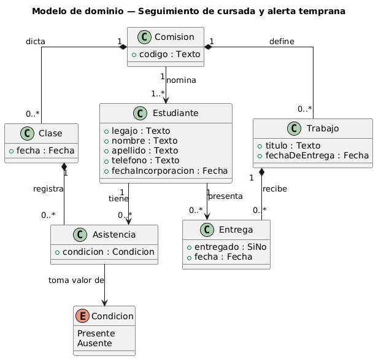
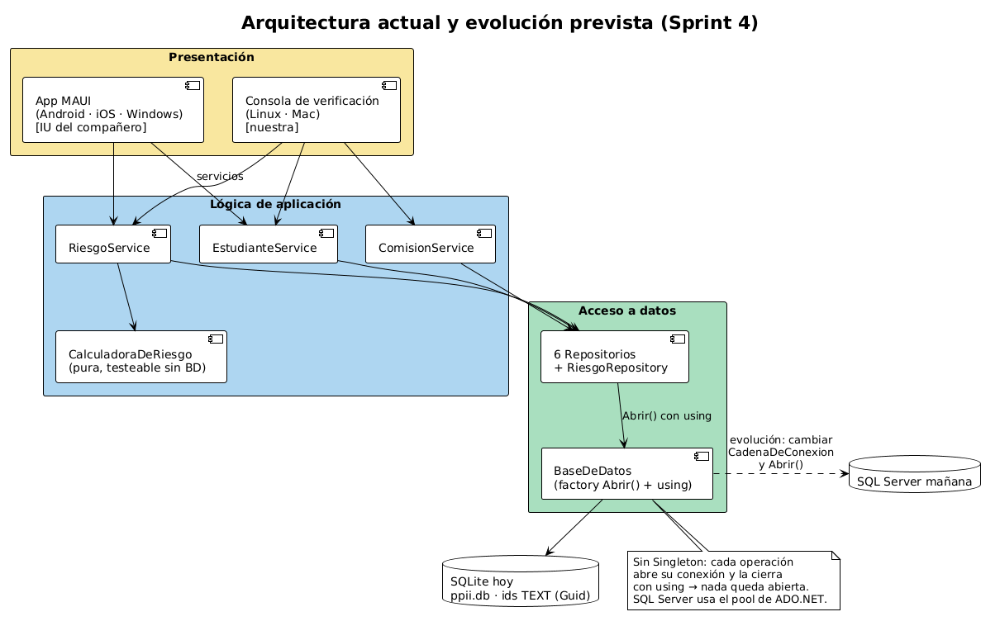

# Grupo 3

## Integrantes

- Elias Villegas
- Yesica Quezada
- Isaias Romero
- Ibañez Mario

## Descripción

Seguimiento de cursada y alerta temprana.
Un panel para que quien sigue una comisión sepa a qué estudiantes contactar esta semana, antes de que abandonen.

## Modelo de dominio

## Modelo de arquitectura

Capas: Presentación (MAUI + consola) → Lógica (Services + calculadora pura) → Acceso a datos (repositorios con `using` + factory `BaseDeDatos.Abrir()`) → SQLite. La migración futura a SQL Server se concentra en `Abrir()` / `CadenaDeConexion` sin tocar el resto de las capas.

